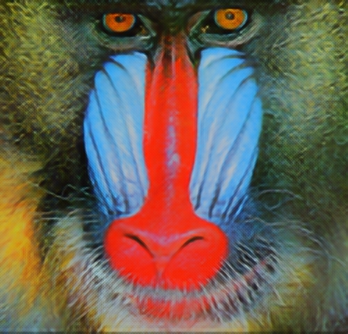
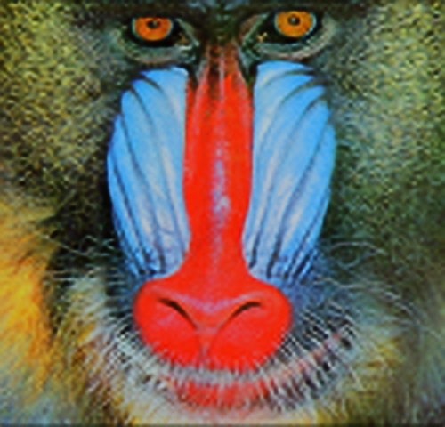

# Image Super-Resolution using SRGAN, ESRGAN, and Interpolated ESRGAN

This repository implements image Super-Resolution techniques using:

- **SRGAN (Super-Resolution Generative Adversarial Network)**
- **ESRGAN (Enhanced SRGAN)**
- **Interpolated ESRGAN**: Combines ESRGAN with a network trained for high PSNR performance.

The goal of this project is to upscale low-resolution images to high-resolution outputs with photo-realistic quality and/or high PSNR fidelity.

---

## Contents

- `srgan.ipynb`: Implementation of SRGAN for super-resolution.
- `esrgan.ipynb`: Implementation of ESRGAN with Residual-in-Residual Dense Blocks.
- `esrgan interpolated.ipynb`: Uses model interpolation between ESRGAN and a PSNR-optimized network.
- `SRGAN_x4.pth`: SRGAN model
- `RRDB_ESRGAN.pth`: ESRGAN model
- `RRDB_PSNR.pth`: RRDB network trained with PSNR optimization
- `RRDB_interp_x4.pth`: interpolated model of ESRGAN and a PSNR-optimized networks.

---

## Highlights

### 1. **SRGAN**

- First GAN-based approach for photo-realistic image super-resolution.
- Trained using a perceptual loss that combines content loss (from VGG) and adversarial loss.
- Produces sharp and realistic textures but may generate artifacts.

### 2. **ESRGAN**

- Improves SRGAN using Residual-in-Residual Dense Blocks (RRDB).
- Relativistic average GAN loss replaces standard discriminator loss.
- Achieves more stable training and superior perceptual quality.

### 3. **Interpolated ESRGAN**

- Interpolates ESRGAN and PSNR-oriented models (e.g., trained with L1 loss).
- Allows balance between perceptual quality and pixel-wise accuracy (PSNR/SSIM).
- Suitable for applications needing a trade-off between realism and fidelity.

---

## Example Results

| Input (LR)                  | SRGAN Output                           | ESRGAN Output                            | Interpolated ESRGAN                             |
| --------------------------- | -------------------------------------- | ---------------------------------------- | ----------------------------------------------- |
|  |  |  |  |

---

## Training Details

- **Dataset**: DIV2K or custom high-resolution dataset.
- **Loss Functions**:
  - **SRGAN**: VGG content loss + Adversarial loss
  - **ESRGAN**: Perceptual + Adversarial + L1 loss
  - **PSNR Model**: L1/MSE loss only
- **Model Interpolation**:
  ```python
  interpolated_weights = alpha * esrgan_weights + (1 - alpha) * psnr_weights
  ```

## Evaluation Metrics

Two commonly used quantitative metrics are used to evaluate the super-resolved images:

- **PSNR (Peak Signal-to-Noise Ratio)**: Measures reconstruction accuracy based on pixel-wise difference.
- **SSIM (Structural Similarity Index)**: Measures perceptual similarity between generated and ground truth images.

These metrics are computed using the luminance (Y channel) after converting the RGB image to YCbCr.

| Model                   | Set5 (PSNR / SSIM)     | Set14 (PSNR / SSIM)    | DIV2K (PSNR / SSIM)    |
| ----------------------- | ---------------------- | ---------------------- | ---------------------- |
| **SRGAN**               | 27.58 / 0.8219         | 24.92 / 0.7014         | 26.74 / 0.7601         |
| **ESRGAN**              | 27.47 / 0.8285         | 24.84 / 0.7080         | 26.64 / 0.7623         |
| **Interpolated ESRGAN** | **28.51** / **0.8416** | **25.56** / **0.7423** | **27.71** / **0.7995** |
